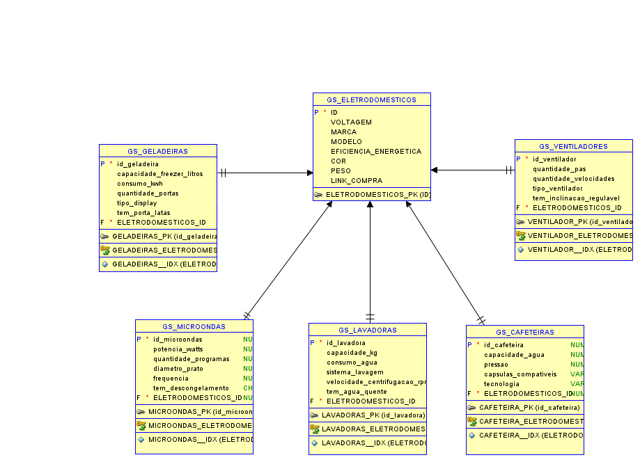

# **Energy Fusion - API de Eletrodomésticos com Eficiência Energética**

### **Descrição do Projeto**
O **GS Spring Energy** é uma API desenvolvida em Java usando o framework Spring Boot, projetada para armazenar, gerenciar e consultar informações sobre eletrodomésticos com eficiência energética de nível **A**. Os dados armazenados são utilizados na construção de um site informativo ou aplicativo móvel que visa promover a eficiência energética.

### **Integrantes do grupo**
- [Arthur Fenili](https://www.linkedin.com/in/arthur-fenili) - RM: 552752
- [Enzo Antunes de Oliveira](https://www.linkedin.com/in/enzo-antunes/) - RM: 553185
- [Vinício Raphael Santana](https://www.linkedin.com/in/vinício-raphael-santana/) - RM: 553813

### **Funcionalidades Principais**
- Gerenciamento de eletrodomésticos de forma centralizada, separando dados genéricos em uma tabela `Eletrodomesticos` e informações específicas em tabelas especializadas (`Geladeiras`, `Ventiladores`, `Cafeteiras`, `Microondas`, `Lavadoras`).
- Operações **CRUD** completas (Create, Read, Update, Delete) para cada tipo de eletrodoméstico.
- Validação de dados com uso de `javax.validation`.
- Documentação de API automatizada com **OpenAPI** (Swagger UI).
- Uso de **HATEOAS** para adicionar links relevantes aos recursos retornados.

---

### **Arquitetura**
- **Back-End**: Desenvolvido em Java com Spring Boot.
- **Banco de Dados**: Oracle, com tabelas específicas para armazenar dados genéricos (`Eletrodomesticos`) e especializados.
- **Documentação de API**: Swagger UI disponível em `/swagger-ui.html`.
- **Objetivo Final**: Utilizar os dados para construir sites ou aplicativos móveis que incentivem o uso de eletrodomésticos energeticamente eficientes.

#### **Modelo Relacional**
  
*O diagrama acima ilustra as relações entre `Eletrodomesticos` e suas tabelas especializadas.*

---

### **Como Rodar o Projeto**
1. **Pré-requisitos:**
    - JDK 17 ou superior.
    - Banco de dados Oracle configurado.
    - Gradle configurado no ambiente.

2. **Configuração do Banco de Dados:**
   Certifique-se de configurar as variáveis de ambiente:
    - `DATABASE_URL`: URL de conexão com o banco.
    - `DATABASE_USERNAME`: Nome de usuário do banco.
    - `DATABASE_PASSWORD`: Senha do banco.

3. **Execução do Projeto:**
    - Clone o repositório.
    - Execute o comando `gradle bootRun` na raiz do projeto.
    - Acesse a documentação da API em `http://localhost:8080/swagger-ui/index.html`.

4. **Endpoints Disponíveis:**
   Abaixo estão os endpoints disponíveis separados por tipo de eletrodoméstico:

   #### **1. Eletrodoméstico (Informações genéricas):**
      | Método | Endpoint                     | Descrição                                                      |
      |--------|------------------------------|----------------------------------------------------------------|
      | POST   | `/api/eletrodomesticos`      | Cria um eletrodoméstico                                        |
      | GET    | `/api/eletrodomesticos`      | Lista todas as informações genéricas sobre os eletrodomésticos |
      | GET    | `/api/eletrodomesticos/{id}` | Obtém informações genéricas de um eletrodoméstico              |
      | PUT    | `/api/eletrodomesticos/{id}` | Atualiza informações genéricas de um eletrodoméstico existente |
      | DELETE | `/api/eletrodomesticos/{id}` | Deleta informações genéricas de um eletrodoméstico pelo ID     |

   #### **2. Geladeiras**
   | Método | Endpoint               | Descrição                        |
   |--------|------------------------|----------------------------------|
   | POST   | `/api/geladeiras`      | Cria uma geladeira               |
   | GET    | `/api/geladeiras`      | Lista todas as geladeiras        |
   | GET    | `/api/geladeiras/{id}` | Obtém detalhes de uma geladeira  |
   | PUT    | `/api/geladeiras/{id}` | Atualiza uma geladeira existente |
   | DELETE | `/api/geladeiras/{id}` | Deleta uma geladeira pelo ID     |
   
   #### **3. Ventiladores**
   | Método | Endpoint                 | Descrição                        |
   |--------|--------------------------|----------------------------------|
   | POST   | `/api/ventiladores`      | Cria um ventilador               |
   | GET    | `/api/ventiladores`      | Lista todos os ventiladores      |
   | GET    | `/api/ventiladores/{id}` | Obtém detalhes de um ventilador  |
   | PUT    | `/api/ventiladores/{id}` | Atualiza um ventilador existente |
   | DELETE | `/api/ventiladores/{id}` | Deleta um ventilador pelo ID     |
   
   #### **4. Cafeteiras**
   | Método | Endpoint               | Descrição                        |
   |--------|------------------------|----------------------------------|
   | POST   | `/api/cafeteiras`      | Cria uma cafeteira               |
   | GET    | `/api/cafeteiras`      | Lista todas as cafeteiras        |
   | GET    | `/api/cafeteiras/{id}` | Obtém detalhes de uma cafeteira  |
   | PUT    | `/api/cafeteiras/{id}` | Atualiza uma cafeteira existente |
   | DELETE | `/api/cafeteiras/{id}` | Deleta uma cafeteira pelo ID     |
   
   #### **5. Microondas**
   | Método | Endpoint               | Descrição                         |
   |--------|------------------------|-----------------------------------|
   | POST   | `/api/microondas`      | Cria um micro-ondas               |
   | GET    | `/api/microondas`      | Lista todos os micro-ondas        |
   | GET    | `/api/microondas/{id}` | Obtém detalhes de um micro-ondas  |
   | PUT    | `/api/microondas/{id}` | Atualiza um micro-ondas existente |
   | DELETE | `/api/microondas/{id}` | Deleta um micro-ondas pelo ID     |
   
   #### **6. Lavadoras**
   | Método | Endpoint              | Descrição                       |
   |--------|-----------------------|---------------------------------|
   | POST   | `/api/lavadoras`      | Cria uma lavadora               |
   | GET    | `/api/lavadoras`      | Lista todas as lavadoras        |
   | GET    | `/api/lavadoras/{id}` | Obtém detalhes de uma lavadora  |
   | PUT    | `/api/lavadoras/{id}` | Atualiza uma lavadora existente |
   | DELETE | `/api/lavadoras/{id}` | Deleta uma lavadora pelo ID     |

---

### **Exemplos de Testes CRUD**

#### **1. Criar uma Cafeteira**
**POST** `/api/cafeteiras`
```json
{
  "capacidadeAgua": 1.5,
  "pressao": 15,
  "capsulasCompativeis": "Nespresso",
  "tecnologia": "Automática",
  "eletrodomestico": {
    "voltagem": "220V",
    "marca": "Marca Exemplo",
    "modelo": "Modelo Exemplo",
    "eficienciaEnergetica": "A",
    "cor": "Preto",
    "peso": 3.5,
    "linkCompra": "https://exemplo.com/produto"
  }
}
```

#### **2. Atualizar uma Cafeteira**
**PUT** `/api/cafeteiras/{id}`
```json
{
  "capacidadeAgua": 1.5,
  "pressao": 15,
  "capsulasCompativeis": "Dolce Gusto",
  "tecnologia": "Automática",
  "eletrodomestico": {
    "voltagem": "Bivolt",
    "marca": "Marca Exemplo",
    "modelo": "Modelo Exemplo",
    "eficienciaEnergetica": "A",
    "cor": "Vermelha",
    "peso": 5,
    "linkCompra": "https://exemplo.com/produto"
  }
}
```
---

#### **1. Criar uma Geladeira**
**POST** `/api/geladeiras`
```json
{
   "capacidadeFreezerLitros": 250,
   "consumoKwh": 37,
   "quantidadePortas": 2,
   "tipoDisplay": "Eletrônico",
   "temPortaLatas": "Sim",
   "eletrodomestico": {
      "voltagem": "Bivolt",
      "marca": "Brastemp",
      "modelo": "Frost Free",
      "eficienciaEnergetica": "A",
      "cor": "Cinza-chumbo",
      "peso": 100,
      "linkCompra": "comprargeladeiras.com.br"
   }
}
```

#### **2. Atualizar uma Geladeira**
**PUT** `/api/geladeiras/{id}`
```json
{
   "capacidadeFreezerLitros": 300,
   "consumoKwh": 50,
   "quantidadePortas": 4,
   "tipoDisplay": "Eletrônico",
   "temPortaLatas": "Sim",
   "eletrodomestico": {
      "voltagem": "220V",
      "marca": "Brastemp",
      "modelo": "Frost Free",
      "eficienciaEnergetica": "A",
      "cor": "Preto",
      "peso": 110,
      "linkCompra": "comprargeladeirasonline.com.br"
   }
}
```
---

#### **1. Criar um Ventilador**
**POST** `/api/ventiladores`
```json
{
   "quantidadePas": 6,
   "quantidadeVelocidades": 3,
   "tipoVentilador": "De Mesa",
   "temInclinacaoRegulavel": "Sim",
   "eletrodomestico": {
      "voltagem": "Bivolt",
      "marca": "Arno",
      "modelo": "Turbo 5000",
      "eficienciaEnergetica": "A",
      "cor": "Preto",
      "peso": 2.5,
      "linkCompra": "linkdecompra.com.br"
   }
}
```

#### **2. Atualizar um Ventilador**
**PUT** `/api/ventiladores/{id}`
```json
{
   "quantidadePas": 5,
   "quantidadeVelocidades": 3,
   "tipoVentilador": "De Teto",
   "temInclinacaoRegulavel": "Não",
   "eletrodomestico": {
      "voltagem": "Bivolt",
      "marca": "Arno",
      "modelo": "Teto 727",
      "eficienciaEnergetica": "A",
      "cor": "Branco",
      "peso": 10,
      "linkCompra": "linkdecompra.com.br"
   }
}
```
---

#### **1. Criar um Micro-ondas**
**POST** `/api/microondas`
```json
{
   "potenciaWatts": 800,
   "quantidadeProgramas": 10,
   "diametroPrato": 30,
   "frequencia": 60,
   "temDescongelamento": "Sim",
   "eletrodomestico": {
      "voltagem": "220V",
      "marca": "Electrolux",
      "modelo": "Easy 30",
      "eficienciaEnergetica": "A",
      "cor": "Prata",
      "peso": 15,
      "linkCompra": "comprarmicroondas.com.br"
   }
}
```

#### **2. Atualizar um Micro-ondas**
**PUT** `/api/microondas/{id}`
```json
{
   "potenciaWatts": 1000,
   "quantidadeProgramas": 15,
   "diametroPrato": 35,
   "frequencia": 60,
   "temDescongelamento": "Sim",
   "eletrodomestico": {
      "voltagem": "220V",
      "marca": "Electrolux",
      "modelo": "Easy 30",
      "eficienciaEnergetica": "A",
      "cor": "Prata",
      "peso": 15,
      "linkCompra": "comprarmicroondas.com.br"
   }
}
```
---

#### **1. Criar uma Lavadora**
**POST** `/api/lavadoras`
```json
{
   "capacidadeKg": 20,
   "consumoAgua": 200,
   "sistemaLavagem": "Agitação",
   "velocidadeCentrifugacaoRpm": 1000,
   "temAguaQuente": "Sim",
   "eletrodomestico": {
      "voltagem": "220V",
      "marca": "Consul",
      "modelo": "Lavamax",
      "eficienciaEnergetica": "A",
      "cor": "Branco",
      "peso": 50,
      "linkCompra": "comprarlavadoras.com.br"
   }
}
```

#### **2. Atualizar uma Lavadora**
**PUT** `/api/lavadoras/{id}`
```json
{
   "capacidadeKg": 10,
   "consumoAgua": 200,
   "sistemaLavagem": "Agitação",
   "velocidadeCentrifugacaoRpm": 1200,
   "temAguaQuente": "Sim",
   "eletrodomestico": {
      "voltagem": "Bivolt",
      "marca": "Consul",
      "modelo": "Lavamax",
      "eficienciaEnergetica": "A",
      "cor": "Branco",
      "peso": 50,
      "linkCompra": "comprarlavadoras.com.br"
   }
}
```
---

### **Considerações Finais**
Este projeto visa contribuir para a conscientização sobre eficiência energética ao fornecer dados organizados e acessíveis de eletrodomésticos qualificados. A API pode ser estendida para incluir novos tipos de dispositivos ou funcionalidades conforme necessário.